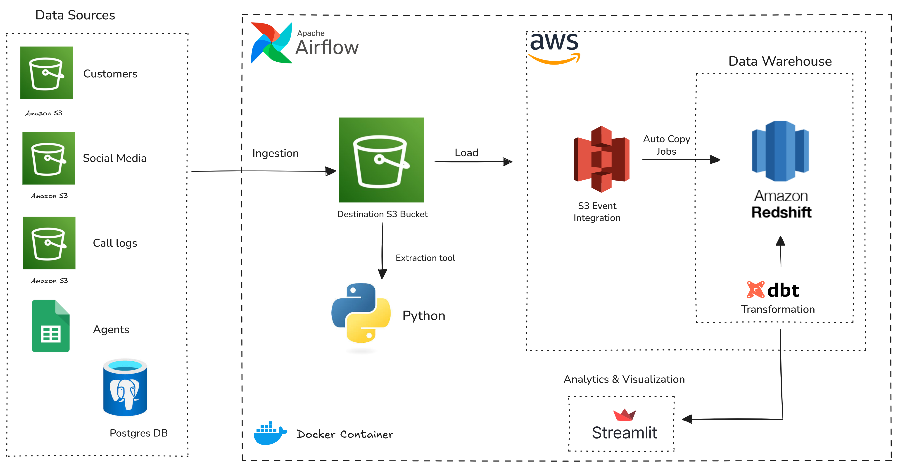

# Design and Implementation of Coretelecom Unified Customer Experience Data Platform

## Project Overview

This project involves the design and implementation of a data platform for Coretelecom's Unified Customer Experience. The platform integrates data from various sources, including customer information, agent details, call logs, media complaints, and web form submissions. The data is processed and stored in a Redshift data warehouse, enabling advanced analytics and reporting capabilities.

## Project Structure
- `dags/`: Contains Airflow DAGs and SQL scripts for data ingestion and transformation.
  - `dags/coretelecom.py`: Airflow DAG for orchestrating the data pipeline.
  - `dags/initialize_autocopy.py`: Airflow DAG to initialize Redshift AutoCopy for efficient data loading and trigger coretelecom DAG.
  - `include/data_ingestion/`: Python scripts for ingesting data from various sources.
  - `include/sql/`: SQL scripts for creating Redshift schemas.
  - `dbt_project/models/`: DBT models for transforming and aggregating data.
- `infrastructure/`: Infrastructure as Code (IaC) scripts for setting up AWS resources using Terraform.
- `app/`: Application code for querying and analyzing data.
  - `app/query.py`: Python scripts for querying the Redshift data warehouse.
  - `app/main.py`: Main streamlit application web interface codes.
- `Dockerfile`: Docker configuration for the custom image.
- `requirements.txt`: Python dependencies for the project.
- `Docker-compose.yml`: Docker Compose configuration for local development and testing.

## Architecture Diagram



## Getting Started

To set up and run the Coretelecom Unified Customer Experience Data Platform, follow these steps:

1. **Clone the Repository**: Clone this repository to your local machine.
2. **Set Up AWS Resources**: Use the Terraform scripts in the `infrastructure/` directory to provision the necessary AWS resources. The AWS credentials should be configured in your environment. You can leverage `aws configure` to set up your credentials.
3. **Build Docker Image**: Build the custom Docker image using the provided `Dockerfile`.
4. **Configure Airflow Connections**: Set up Airflow and configure the connections to AWS services. The required connections include:
   - `aws_source`: AWS credentials for accessing source S3 bucket and parameter store.
   - `aws_dest`: AWS credentials for accessing destination S3 bucket.
   - `redshift_conn`: Connection details for the Redshift cluster.
   - `google_cloud_conn`: Connection details for Google Cloud services (google spreadsheets).
5. **Run Airflow DAGs**: There are two main DAGs to run:
   - `initialize_autocopy`: This DAG initializes Redshift AutoCopy for efficient data loading and triggers the `coretelecom` DAG.
   - `coretelecom`: This DAG orchestrates the data ingestion, transformation, and loading processes.
6. **Monitor and Maintain**: Use Airflow's UI to monitor the DAG runs and ensure that the data pipeline is functioning correctly.
7. **Access Streamlit Application**: Run the Streamlit application to visualize and analyze the data stored in Redshift. To do this:
   - Navigate to the `app/` directory.
   - Create a .streamlit folder and add a `secrets.toml` file with the Redshift connection details.
    - Example `secrets.toml` content:
      ```
      [connections.redshift_db]
      host = "your-redshift-cluster-endpoint"
      port = "5439"
      database = "your-database-name"
      user = "your-username"
      password = "your-password"
      ```
   - Install Streamlit if not already installed: `pip install streamlit`.
   - Run the command: `streamlit run main.py`.

## Choice of Tools and Technologies

- **Apache Airflow**: Used for orchestrating the data pipeline, scheduling tasks, and managing dependencies.
- **AWS (Amazon Web Services)**: Chosen for its robust cloud infrastructure and wide range of services suitable for building scalable data platforms.
- **Amazon S3**: Used as the primary data lake for storing raw data files from various sources.
- **Amazon Redshift**: Chosen as the data warehouse solution for its scalability, performance, and integration with other AWS services.
- **DBT (Data Build Tool)**: Utilized for transforming and modeling data within the Redshift data warehouse.
- **Terraform**: Employed for Infrastructure as Code (IaC) to provision and manage AWS resources.
- **Docker**: Used for containerizing the application and ensuring consistent environments across development and production.
- **Python**: The primary programming language for writing data ingestion scripts, Airflow DAGs, and the Streamlit application.

## Key Features

- **Data Ingestion**: Automated ingestion of data from multiple sources, including S3 buckets, postgres transactional database and Google Sheets.
- **Data Transformation**: Use of DBT for transforming raw data into structured formats suitable for analysis.
- **Scalability**: Leveraging AWS services to ensure the platform can scale with increasing data volumes and user demands.
- **Monitoring and Logging**: Integration with Airflow's monitoring capabilities to track the status of data pipeline tasks and log any errors for troubleshooting.
- **Redshift AutoCopy**: Implementation of Redshift AutoCopy for efficient and automated data loading from S3 to Redshift leveraging s3 event integration.
- **Incremental Data Loads**: Support for incremental data loading to optimize performance and reduce processing time.
- **Idempotent Operations**: Ensuring that data ingestion and transformation processes can be safely re-run without causing data duplication or inconsistencies.
- **Retries and alerting**: Built-in retry mechanisms and alerting for failed tasks to ensure reliability and prompt issue resolution.
- **Data Quality Checks**: Implementation of data quality checks to validate the integrity and accuracy of ingested and transformed data.
- **Custom Docker Image**: Creation of a custom Docker image to encapsulate all codes, dependencies, and configurations required for the data platform.
- **Infrastructure as Code**: Use of Terraform to manage and provision AWS resources, ensuring reproducibility and version control of infrastructure.
- **Streamlit Application**: Development of a Streamlit application for data visualization and analysis, providing an interactive interface for stakeholders to explore the data.

## Further Work

- **Advanced Analytics**: Implement advanced analytics and machine learning models on top of the data platform to derive deeper insights into customer experience.
- **Enhanced Data Visualization**: Integrate with BI tools for enhanced data visualization and reporting capabilities.
- **Cost Optimization**: Continuously monitor and optimize the cost of AWS resources used in the platform.
- **Security Enhancements**: Implement additional security measures, such as data encryption and access controls, to protect sensitive customer data.
